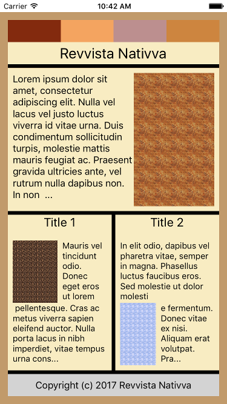

# Projeto 2: Revvista Nativva

Este projeto é parte do curso **Aplicativos Móveis com o React Native**, criado por Renan Martins (@nbkhope).

[Clique aqui para acessar o curso](https://www.udemy.com/course/aplicativos-moveis-com-o-react-native/).

## Screenshot



## Como Rodar

Instale as dependências:

```sh
npm install
```

Rode:

```sh
npm start
```

Existem várias maneiras de abrir o aplicativo. Por exemplo, para abrir o aplicativo no iPhone:

- Deixe o seu celular conectado na mesma rede de Internet do seu computador.
- Abra o app de Camera e aponte-a para o código QR do terminal.
- Ele abrirá o app do Expo Go e carregará o aplicativo. Se não tiver o app do Expo, baixe-o na loja de apps.

## Em Caso de Erro

Como o desenvolvimento do React Native ocorre frequentemente, uma nova versão poderá deixar o Expo de funcionar com o aplicativo. Para resolver isso, basta atualizar os pacotes em `package.json` para a versão mais atual.

Uma maneira de saber qual os números específicos usar é assim:

- Em algum outro lugar, instale e use `create-expo-app` para gerar um novo projeto de amostra.
- Verifique o número das versões desse novo aplicativo e copie de acordo.
